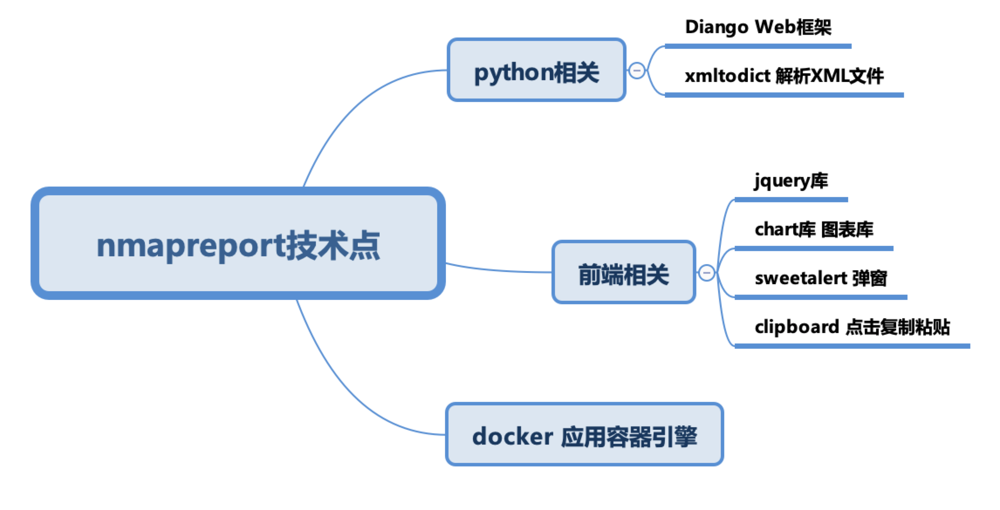
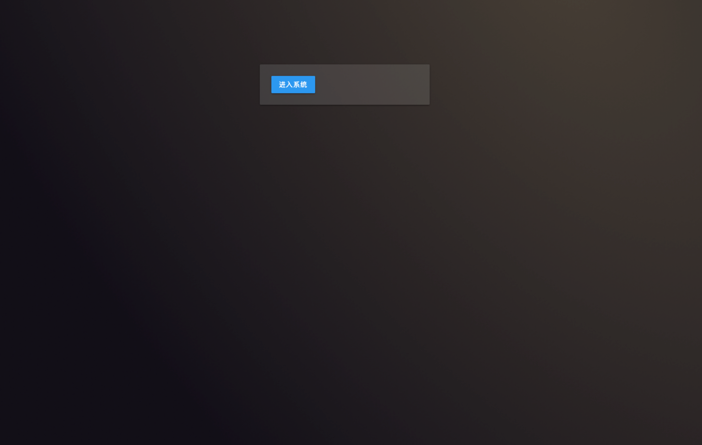
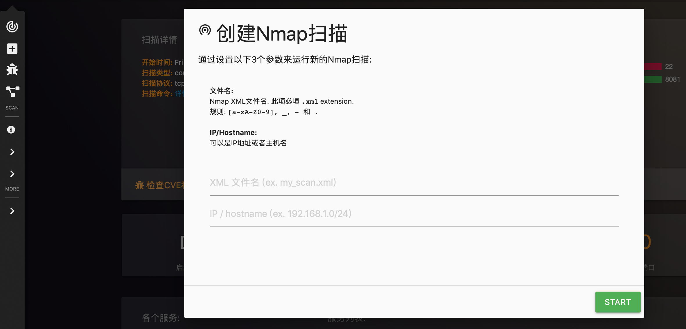
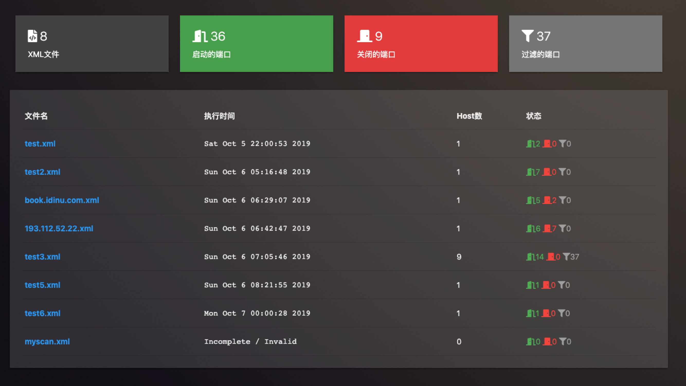
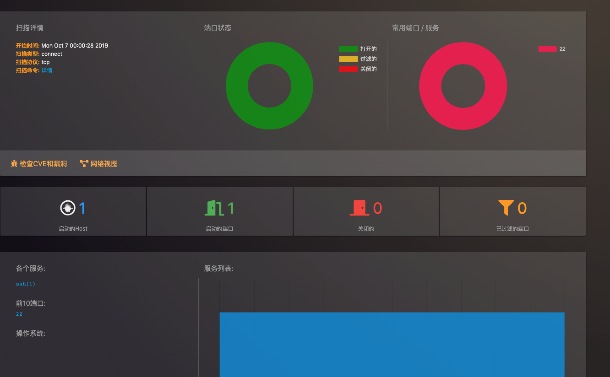
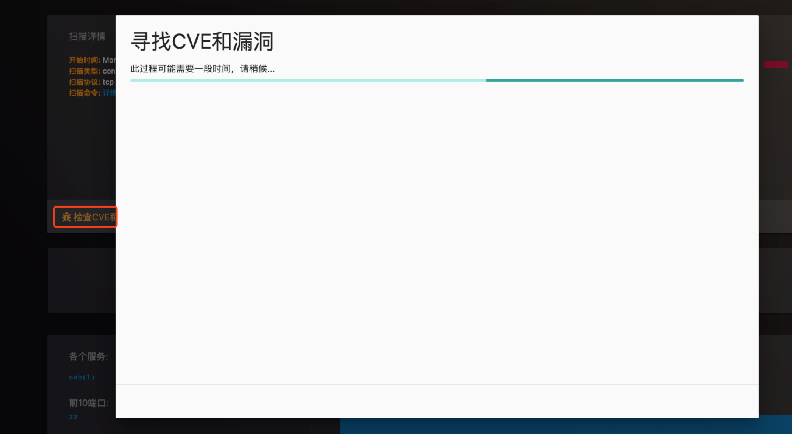

# nmapreport
A Web Dashbord for Nmap And Cve XML Report 
# 使用说明

## 目录结构
```
 |——————docker docker配置相关
 |    |———settings.py diango、python的基础系统环境配置
 |    |———urls.py URL分发器（路由配置文件）
 |——————nmap
 |    |———nse 暂时不需要
 |    |———cron.py 任务调度规则
 |——————static 本地文件,其中包括css文件夹存放css文件
 |    |———async.js js脚本
 |——————templates html模板文件
 |——————nmapreport
 |    |———main.html 页面主体
 |    |———nmap_auth.html 授权模板（暂时不用）
 |    |———nmap_hostdetails.html network模板
 |    |———nmap_ndiff.html nmap cve比对（是否重新扫描）
 |    |———nmap_network.html 网络视图模块
 |    |———nmap_portdetails.html 报告详情
 |    |———nmap_xmlfiles.html 主页显示内容
 |    |———report.html 报告
 |——————api.py #请求接口方法实现
 |——————apps.py 启动入口
 |——————functions.py 常规函数
 |——————functions_nmap.py nmap相关函数
 |——————ndiff.py nmap，cve比对
 |——————network.py 网络视图相关逻辑
 |——————pdf.py pdf生成逻辑
 |——————token.py token生成逻辑
 |——————urls.py 路由
 |——————views.py 视图跳转逻辑
 ```
 
 ## 需要的环境
 - docker（https://docs.docker.com/）
 - Virtualbox[https://www.virtualbox.org/wiki/Downloads] (演示使用)
 
 ## 技术说明
 
 ## 演示环境说明
 - 如何本地搭建环境测试
   - 搭建两台虚拟机
   - 一台作为扫描、一台被扫描（或者多台，可安装windows、mac等）建议使用`virtualbox`
   
## 系统使用
1.点击"进入系统"

2.创建Nmap扫描



3.扫码列表


4.扫码详情


5.cve检查漏洞
 
 ## 如何使用
 ```$xslt
docker run -d -v /opt/nmapreport/docker/xml:/opt/xml -p 8081:8000 1249913118/nmapreport

```
代码位置：/opt/nmapdashboard/nmapreport,可以将此文件映射出来，直接修改

> 注意：代码修改可执行`docker build -t nmapreport:latest .`如果不想使用docker可以直接部署在linux环境内（mac、centos、ubuntu)
> 部署可参考docker的dockerfile文件步骤


